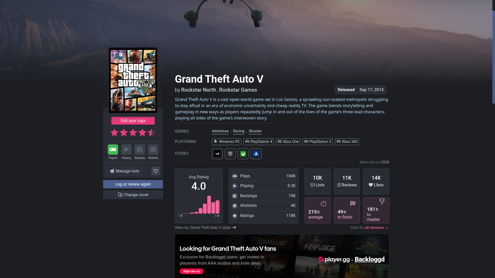
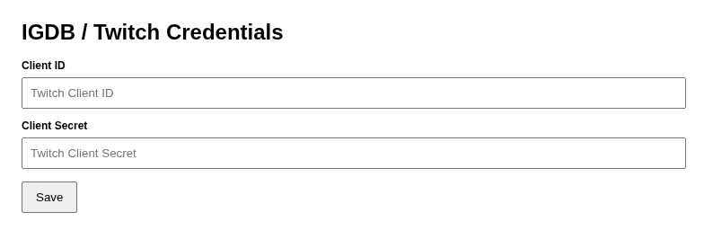

# Backloggd Stores

Chrome extension and Userscript that adds **store links** (Steam, Epic, GOG, Xbox, PlayStation, Nintendo, itch.io) to game pages on [Backloggd](https://backloggd.com), using the IGDB API.


## Features

- Adds a compact **Stores** block on Backloggd game pages
- Fetches official/known store URLs from IGDB
- Supports Turbo SPA navigation (re-renders on in-site page transitions)
- Caches OAuth token and game-store responses to reduce API calls
- **Cross-platform**: Available as a Chrome Extension or a standalone Userscript.
- 
## Screenshots




## Installation (Developer Mode)

### Option A: Chrome Extension (Developer Mode)

1. Clone this repository or download the source code from the “[Releases](https://github.com/alyreniko/backloggd-stores-extension/releases)” page:
   ```bash
   git clone https://github.com/alyreniko/backloggd-stores-extension.git
   cd backloggd-stores-extension
   ```
2. Open `chrome://extensions`
3. Enable **Developer mode**
4. Click **Load unpacked**
5. Select the project folder

### Option B: Userscript (Tampermonkey / Violentmonkey)

If you prefer using a script manager
1. Install Tampermonkey or Violentmonkey.
2. Click here to install: Install from [Greasy Fork](https://greasyfork.org/scripts/577398) (or use the backloggd-stores.user.js file from this repo).

## Configuration

This extension requires IGDB/Twitch API credentials.
1. Open the Twitch Developer Console: https://dev.twitch.tv/console
2. Create an application (any name is fine).
3. Copy:
   - **Client ID**
   - **Client Secret**
2. Open the **Settings** or the page for any game, then click **Open settings**
3. Paste credentials and click **Save**

## How it works

- `content.js` (or the Userscript) injects a Stores widget into Backloggd game pages.
- `Backend logic`:
  - gets OAuth token from Twitch
  - queries IGDB `/v4/games`
  - normalizes website links to known stores
  - caches results to minimize API overhead

## Tech stack

- Chrome Extension Manifest V3
- Vanilla JavaScript
- IGDB API + Twitch OAuth Client Credentials flow

## Project structure

```text
.
├─ manifest.json
├─ content.js
├─ background.js
├─ options.html
├─ options.js
├─ styles.css
├─ icons/
└─ assets/
   └─ screenshots/
```

## Privacy / Data

- Credentials are stored locally in your browser (chrome.storage or GM_setValue).
- Token and game cache are stored in `chrome.storage.local`.
- No external analytics or tracking is included by default.

## Roadmap

- [ ] Add Firefox-compatible build
- [ ] Add per-store enable/disable toggles
- [ ] Optional localization

## Contributing

Issues and PRs are welcome.  
If reporting a bug, include:
- Backloggd URL
- Expected vs actual result
- Console logs (if any)

## License

MIT
